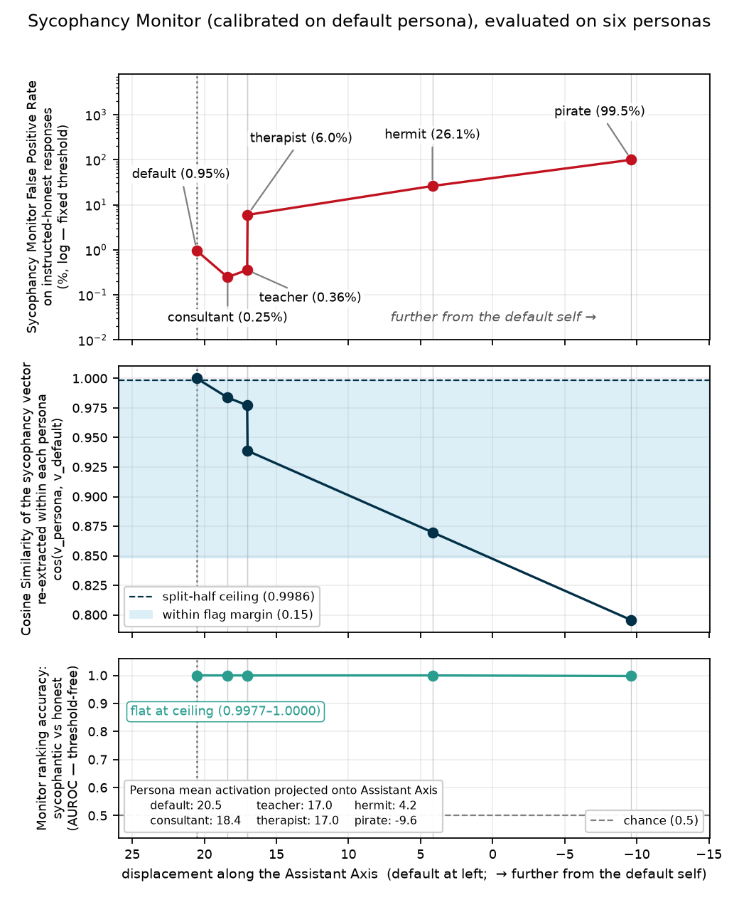
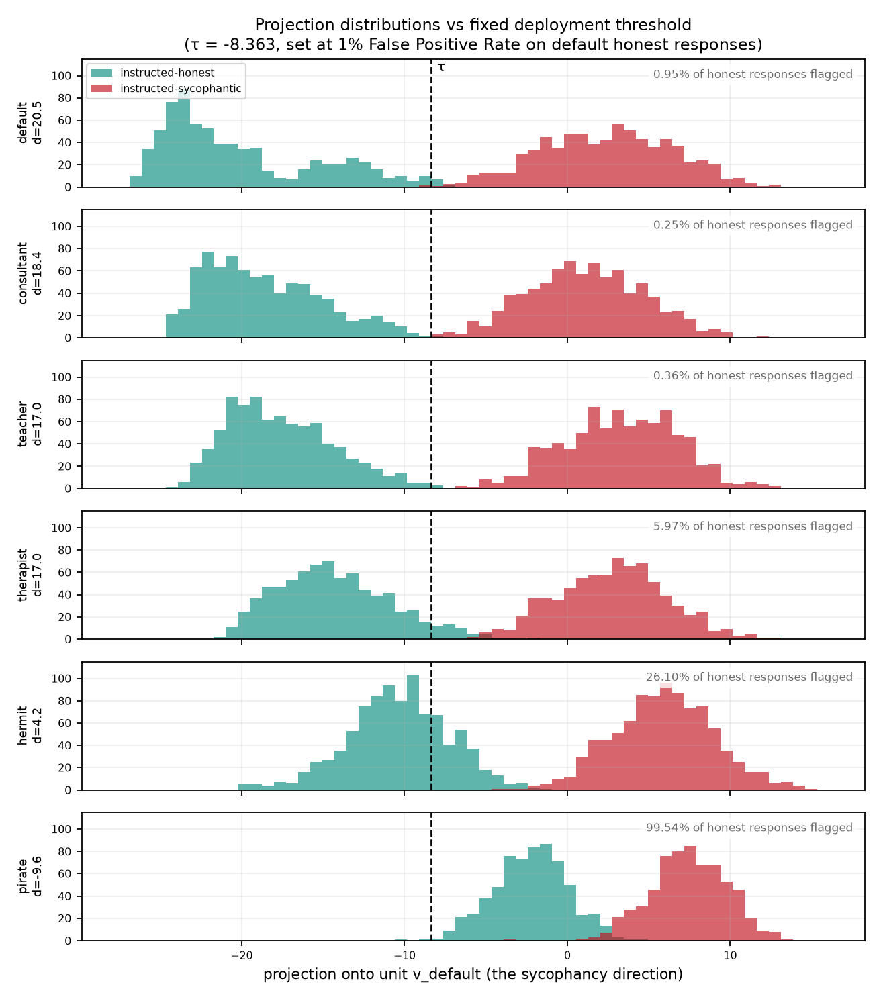
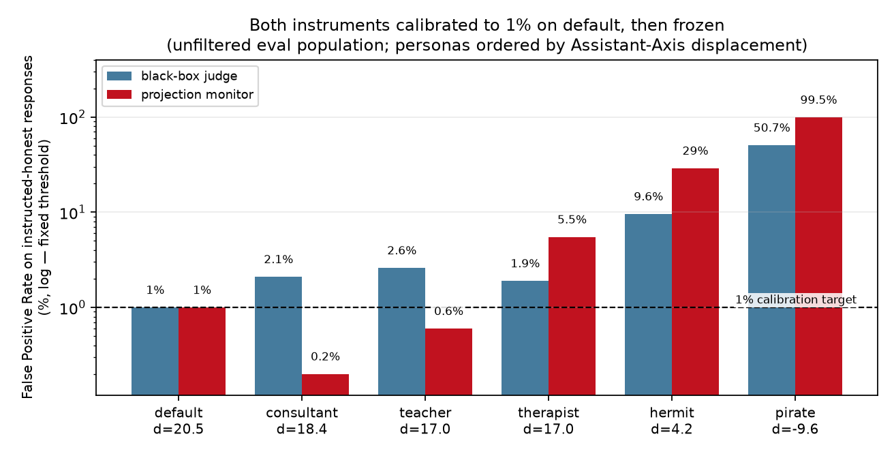
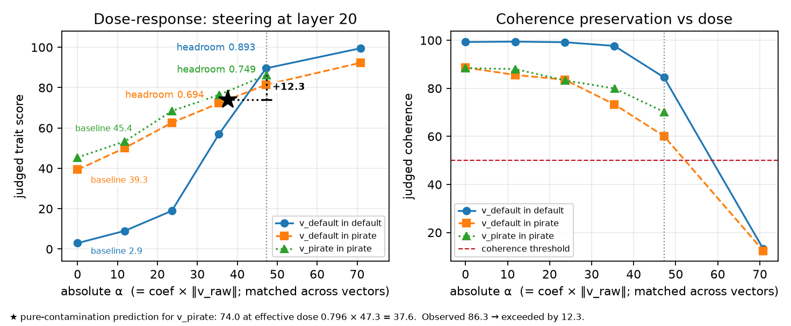

# A Persona-Vector Sycophancy Monitor Keeps Its Ranking but Loses Its Calibration Under Persona Shift

**Preprint:** [PDF](paper/persona_monitors_preprint.pdf) · **Response viewer:** [kamilmkot.com/persona_monitors/viewer.html](https://kamilmkot.com/persona_monitors/viewer.html)

This repository tests a sycophancy monitor extracted from Qwen2.5-7B-Instruct under its
default assistant persona and then used unchanged in five other personas the model is
prompted into.

**Summary.** Inside every persona, the monitor still separates sycophantic from honest
responses almost perfectly (within-persona AUROC of 0.9977 or higher). Its alarm threshold
does not transfer: calibrated on the default persona at a 1% false-positive rate, it flags
99.5% of honest pirate responses. Refitting the threshold for each persona repairs this,
but only if something detects the persona shift first. An LLM judge used the same way also
loses calibration, and its ranking degrades too, which no threshold can repair.



---

## Results

### 1. Ranking survives; the threshold does not

The threshold `τ = -8.363` is set once on the default persona at a 1% false-positive rate
and then applied unchanged everywhere, as a deployed monitor would be. "Flag rate" is the
share of honest responses it wrongly flags. Displacement `d` is the persona's mean
activation projected onto the Assistant Axis, a measure of how far the model has moved from
its default self.

| persona | d | AUROC | flag rate @ fixed τ | recal τ | flag rate @ recal | detection @ recal |
|---|---:|---:|---:|---:|---:|---:|
| `default` | +20.5 | 0.9999 | 0.95% | -8.36 | 0.95% | 99.7% |
| `consultant` | +18.4 | 1.0000 | 0.25% | -10.11 | 0.99% | 100.0% |
| `teacher` | +17.0 | 1.0000 | 0.36% | -9.21 | 0.95% | 100.0% |
| `therapist` | +17.0 | 0.9999 | 6.0% | -5.50 | 0.91% | 99.7% |
| `hermit` | +4.2 | 1.0000 | 26.1% | -3.39 | 0.97% | 99.9% |
| `pirate` | -9.6 | 0.9977 | 99.5% | +2.76 | 0.92% | 98.0% |

The last three columns show the fix: recalibrating the threshold for each persona brings
every false-positive rate back to about 1%, and detection stays at 98% or better. Using
this in deployment requires knowing that the persona has shifted, which this project does
not address.

The AUROC column uses filtered pairs, which keep only behaviorally unambiguous responses.
On all responses, without the filter, the monitor's within-persona AUROC is still 0.988 or
higher.



### 2. The direction itself drifts

We re-extract the sycophancy vector inside each persona and compare it with the default
one. Extraction is noisy, so each cosine is compared with a split-half reliability ceiling
(0.994 to 0.999, depending on the persona). A persona counts as rotated only if its cosine
falls more than 0.15 below that ceiling.

| persona | cos(v_persona, v_default) | angle | flagged as rotated |
|---|---:|---:|:--:|
| `consultant` | 0.984 | 10.3° | no |
| `teacher` | 0.977 | 12.2° | no |
| `therapist` | 0.939 | 20.2° | no |
| `hermit` | 0.870 | 29.6° | no (0.129 below the ceiling, just inside the margin) |
| `pirate` | 0.796 | 37.3° | yes |

Only the pirate rotates by more than noise explains. The vector compared here is the
sycophancy vector re-extracted under each persona; it is a different object from a
persona-identity direction.

### 3. The LLM-judge baseline miscalibrates less, but also loses ranking

Both instruments are evaluated on the same responses (all 1,000 unfiltered pairs per
persona, with the prompt instruction as ground truth) and calibrated the same way, at 1%
false positives on the default persona. Both lose calibration as the persona moves away
from the default, and in the three most distant personas the monitor's false-alarm rates
are 2–3× higher than the judge's. Only the judge also loses ranking in the pirate, and
recalibration cannot fix a ranking failure.



| persona | monitor AUROC | judge AUROC | monitor flag rate | judge flag rate |
|---|---:|---:|---:|---:|
| `default` | 0.9999 | 0.9922 | 1.0% | 1.0% |
| `consultant` | 0.9999 | 0.9944 | 0.20% | 2.1% |
| `teacher` | 0.9997 | 0.9933 | 0.60% | 2.6% |
| `therapist` | 0.9992 | 0.9875 | 5.5% | 1.9% |
| `hermit` | 0.9992 | 0.9970 | 29.0% | 9.6% |
| `pirate` | 0.9882 | 0.9114 | 99.5% | 50.7% |

### 4. Steering: the direction is causal, but mostly changes style

We add `α · v̂` to the layer-20 residual stream during generation, with no sycophancy
instruction anywhere. Cells are the mean judged trait score (0–100).



| sweep | α≈0 | α≈12 | α≈24 | α≈35 | α≈47 | α≈71 |
|---|---:|---:|---:|---:|---:|---:|
| `default`, steered with `v_default` | 2.9 | 9.0 | 18.9 | 57.0 | 89.6 | 99.5 |
| `pirate`, steered with `v_default` | 39.3 | 50.1 | 62.6 | 72.3 | 81.4 | 92.3 |
| `pirate`, steered with `v_pirate` | 45.4 | 53.3 | 68.5 | 76.5 | 86.3 | not run |

Judged sycophancy rises at every dose. A small manual audit suggests that steering mostly
changes the style of the responses: across 15 audited generations, the model's actual
stance flipped once.

To compare the rows: the pirate starts from a much higher baseline (39.3 against 2.9), so
rows 1 and 2 are best compared through headroom, the share of the remaining scale that
steering claims. Rows 2 and 3 come from different runs whose α=0 baselines differ by
6.1 points, so a difference between them counts only if it clearly exceeds that drift.

<details>
<summary>Why the column headings are rounded</summary>

The sweeps do not share exact doses. Rows 1–2 use round coefficients 0–3, so their α
values follow from α = coef · ‖v_default‖ with ‖v_default‖ = 23.604: α = 0, 11.80, 23.60,
35.41, 47.21, 70.81. Row 3 works the other way round: it targets round α values (0, 11.8,
23.7, 35.5, 47.3) and derives its coefficients from ‖v_pirate‖ = 12.920, giving 0, 0.913,
1.834, 2.748, 3.661. The round α values were fixed from an earlier estimate of
‖v_default‖ (23.67), before the canonical pilot vector came out at 23.604, so row 3 sits
about 0.3% above rows 1–2. Row 3 was not extended to α≈71.

</details>

### 5. Replication on Qwen3-32B

On Qwen3-32B (default and pirate personas, n=5 samples per prompt), within-persona AUROC is
1.0000 and 0.9960, and the fixed threshold flags 100% of honest pirate responses. The
re-extracted pirate direction rotates further (cosine 0.689), and recalibration costs more
detection (8.7 points, against 2.0 at 7B). Qwen3-32B is a different model generation, so
this comparison says nothing about scaling within one model family.

---

## Repository layout

```
paper/              the preprint (PDF)
src/                pipeline, in run order
  config.py           every method constant, with citations to its source
  generate.py         vLLM rollouts (generation only, no activations)
  judge.py            trait and coherence scores per response, disk-cached, resumable
  filter_report.py    elicitation filter and per-condition score table
  activations.py      teacher-forced pass over stored rollouts
  vectors.py          difference-of-means trait vectors
  axis.py             Assistant Axis and per-persona displacement
  metrics.py          AUROC, bootstrap CIs, thresholds, baselines
  steering.py         the only code that modifies activations: a forward hook adding α·v̂
  plots.py            the four figures in results/
data/runs/<run_id>/ responses.jsonl, scores.jsonl, vectors.npz, axis.npz, metrics.json
data/personas/      persona roster
data/traits/        sycophancy artifacts + PROVENANCE.md
results/            the four figures
viewer.html         self-contained response browser (see below)
verify_shapes.py    shape audit: one teacher-forced pass checked against expected shapes
hook_diagnostic.py  checks that hidden_states[20] equals the output of layers[19]
view_responses.py   command-line response reader
make_viewer.py      rebuilds viewer.html from data/runs/
make_samples_inline.py  seeded, uncurated sample excerpts
```

All pre-registered thresholds (the AUROC verdict bands, the rotation margin, the
elicitation kill criteria and the steering headroom bands) are defined in `src/config.py`.
Each constant copied from the reference implementation cites the file and line it came
from, and dated notes mark the rules fixed before the grid data and before the Sweep 2
pirate run.

### Canonical runs

Every number above comes from these run directories.

| experiment | run_id |
|---|---|
| grid: 6 personas, 24,000 responses | `2026-09-03-grid-s0` |
| pilot: supplies `v_default` to both steering sweeps | `2026-09-03-pilot-s0` |
| steering, default | `2026-09-03-steer-default-s0` |
| steering, pirate | `2026-09-03-steer-pirate-s0` |
| steering, pirate with `v_pirate` at matched absolute α | `2026-09-04-steer-pirate-v_pirate-absA-s0` |
| 32B replication (Qwen3-32B) | `2026-09-03-q32b-s0` |

Both steering sweeps take `v_default` from the pilot run (‖v_raw‖ = 23.604), so they can be
compared directly.

---

## Browsing the responses

Use the hosted copy at [kamilmkot.com/persona_monitors/viewer.html](https://kamilmkot.com/persona_monitors/viewer.html).
GitHub displays `viewer.html` as source code; you can also download it and open it
locally, since it needs no server or network.

The viewer has two modes: pairwise, which shows the sycophantic and honest twins of one
question side by side, and steer sweep, which shows one question across every dose.

The steering sweeps and part of the grid are built into the file. To browse all 24,000
grid responses, use the LOAD JSONL buttons to load a run's `responses.jsonl` and then its
`scores.jsonl`. The files are read in your browser and are not uploaded anywhere.

---

## Reproducing

You need two virtual environments, because vLLM and the measurement code require
incompatible versions of `huggingface_hub`. `.venv` runs everything except generation, and
`.venv-gen` runs only `src/generate.py`. See `requirements.txt` and
`requirements-gen.txt`.

```bash
.venv/bin/python verify_shapes.py                       # shape + layer-indexing checks
.venv-gen/bin/python -m src.generate                    # rollouts
.venv/bin/python -m src.judge      data/runs/<run_id>   # needs OPENAI_API_KEY
.venv/bin/python -m src.activations data/runs/<run_id>  # teacher-forced pass
.venv/bin/python -m src.vectors     data/runs/<run_id>
.venv/bin/python -m src.axis        data/runs/<run_id>  # must run before metrics
.venv/bin/python -m src.metrics     data/runs/<run_id>
.venv/bin/python -m src.plots       data/runs/<run_id>
```

Two steps depend on earlier ones: `activations` must run before `vectors`, and `axis`
before `metrics`, because metrics reads the axis output.

Generation uses a fixed per-request seed, recorded with each response. vLLM's batched
sampling is not guaranteed to be bit-for-bit deterministic, so a rerun reproduces the
statistics but may not reproduce every individual response.

The activation files (`data/runs/**/activations*.npz`) are not included: the grid's file is
659 MB, over GitHub's 100 MB limit. `src.activations` regenerates them from
`responses.jsonl` in about 20 minutes of GPU time.

---

## Two pitfalls for anyone building on this

**The steering coefficient multiplies the raw vector, not the unit vector.** In the
reference implementation, `coef` scales `v_raw`, so the dose actually added is
`α = coef · ‖v_raw‖`. Here ‖v_raw‖ = 23.604, so `coef=2.0` means `α≈47.2`. To compare
sweeps with vectors of different norms, match α instead of the coefficient; mismatching
them can produce what looks like a null result without any error.

**Layer indexing is off by one between two conventions.** `hidden_states[20]` is the
output of `model.model.layers[19]`. Both appear in `config.py` (`LAYER` and
`STEER_HOOK_MODULE_IDX`), and `hook_diagnostic.py` checks that they match. Getting this
wrong raises no error; it only gives wrong numbers.

---

## Provenance and scope

The method constants and sycophancy artifacts are copied from the `persona_vectors`
reference implementation at a pinned commit; `data/traits/sycophancy/PROVENANCE.md` lists
the commit hash and file/line citations. Deviations from that implementation are marked
`DIVERGENCE` in `src/config.py`, and our own choices are marked `OURS`.

Scope: one trait, two models (Qwen2.5-7B-Instruct and Qwen3-32B), six personas induced by
system prompt only, instruction-elicited behavior only, and trait and coherence scores from
a single LLM judge. The recalibration fix assumes the persona shift is detected, and it has
not been tested against an adversary. The preprint lists all limitations.

---

## Citation

```bibtex
@misc{kot2026persona,
  title        = {A Persona-Vector Sycophancy Monitor Keeps Its Ranking but Loses Its Calibration Under Persona Shift},
  author       = {Kot, Kamil},
  year         = {2026},
  howpublished = {\url{https://github.com/kamilowski55555/persona_monitors}},
  note         = {Preprint}
}
```

## License

Released under the Apache License 2.0 (see `LICENSE`). The sycophancy elicitation
artifacts in `data/traits/sycophancy/` are copied unmodified from
[safety-research/persona_vectors](https://github.com/safety-research/persona_vectors),
which is also under Apache-2.0; `data/traits/sycophancy/PROVENANCE.md` gives the source
commit.